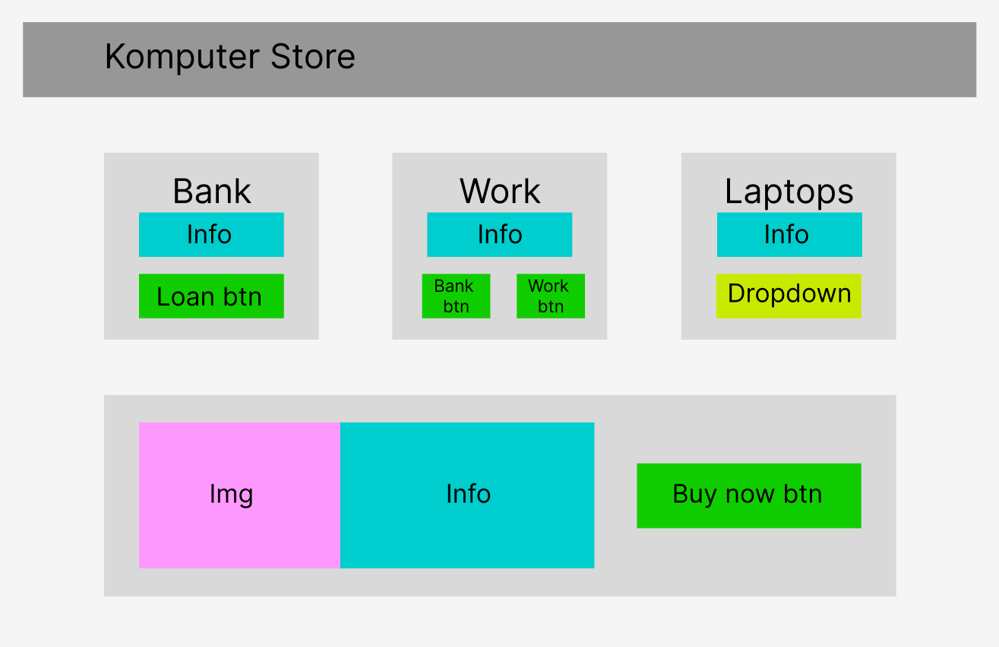

# Front-end Assignment 1: Komputer Store

​

### Table of contents

- [Introduction](#introduction)
- [Wireframe](#wireframe)
- [HTML code and CSS](#html-code-and-css)
- [Adding the JavaScript Code](#adding-the-javascript-code)
- [Where to access/installations](#where-to-acces/installation)
- [Author](#author)
  ​
  ​

## Introduction

​
This is my submission for the first assignment in front-end portion of the Java accelerate course provided by Noroff university.
In this assignment, I had to tackle a few challenges; create a webpage using HTML and CSS, providing Javascript code to the website to make the functions within it work as intended by the assignment text, pull data from a Heroku webpage and finally, deploy my project onto Heroku.
The assignment was handed out by Piotr Dziubinski.

## Wireframe

I initialized my project by creating a wireframe to serve as a guide when developing the website. The tool I used for this was Figma, which is an excellent site for creating initial website designs and pitches. I took great inspiration from the picture provided in the assignment text, but made it more clear for myself by organizing what part of the website serves what function; what is a button, what is pure texts, etc.



## HTML Code and CSS

Once my wireframe was completed, I started working on the HTML code; I added different containers and boxes in regard to what I hade drafted on my wireframe, focusing on just getting the components in the file. I did the CSS side by side, adding the different styling as I made more components, so that my site would look more and more like it was intended to do. Initally I decided to use listeners for the buttons (more on that in the JavaScript section) but ultimately decided for the sake of cleanness to code a good portion of the buttons using the onclick HTML function instead to avoid clutter and unneccessary repeating code. I kept the stylng pretty bare, focusing on making the buttons sleek and apparent when interacting. The colour green was chosen as a not-too-disruptive contrast to the otherwise white, black and grey colours.

## Adding the JavaScript code

Adding the JavaScript code is the real focus of this assignment, so this is where most of the functionality that makes everything work is located.
First off, I mapped out what actually needs to be tracked on the site and saved to the user; that is their salary, bank account and loan. I stored these variables in the constructor for the user, so that I could freely interact with these and change them as needed by future functions.

Furthermore, I initialized the other components I would need to have everything in order to start coding the interactions between the components. That is, I fetched the computers from the Heroku link provided by the assignment text. This means that I now have everything I need; I have the numbers that needs tweaking and I have the data to pull the computers from.

At the very start, I began with what I considered to be the 'simpler' functions; changing the text and making the user able to change what computer is shown on the webpage. I did this using the dropdown options button to decide which computer is currently 'active' and then change the text, price and image based on what computer is currently selected. (Note; the images are not transparent, so it causes some unsavory colours as background colours for the images, but this is in my opinion a problem with the image files and not the code).

Once these were implemented and I had connected the text elements I intended to use for currency to their own seperate elements, I started working on the actual monetary functions; buying, loaning, paying back and receiving pay for work. The work function was simple enough; updating the pay currency with 100 everytime the work button is pressed. With the loan function, I added a prompt where the user themselves choose an amount to loan, then add that amoun to their balance and loan values. The loan value decides whenever the payback button is active, which works the same way; prompts the user to put in how much they wish to pay back. When the loan is fully repaid, the button is hidden from the user.

Finally, the button handling money going from pay to balance simply transfers that money over with a simple + on the balance side and - on the pay side, minus potential loan cutoffs (10%).
​

### DIRECTORY

​

```
| README.md
|___ komputer-store-assignment
|      | index.html
|      | style.css
|      | script.js
```

​
​

## Where to access/installations

Create an SSH key and pull the project from the git repository.

## Project status

Finished.
​

## License

This project is open-source. You are free to use any of the code in your own projects, as long as the work is credited.
​

## Authors and acknowledgment

**Code authos:**

- [Linnea Johansen](https://gitlab.com/LinneaJohansen)

**Assignment given by:**

Piotr Dziubinski, Lecturer at Noroff University College
